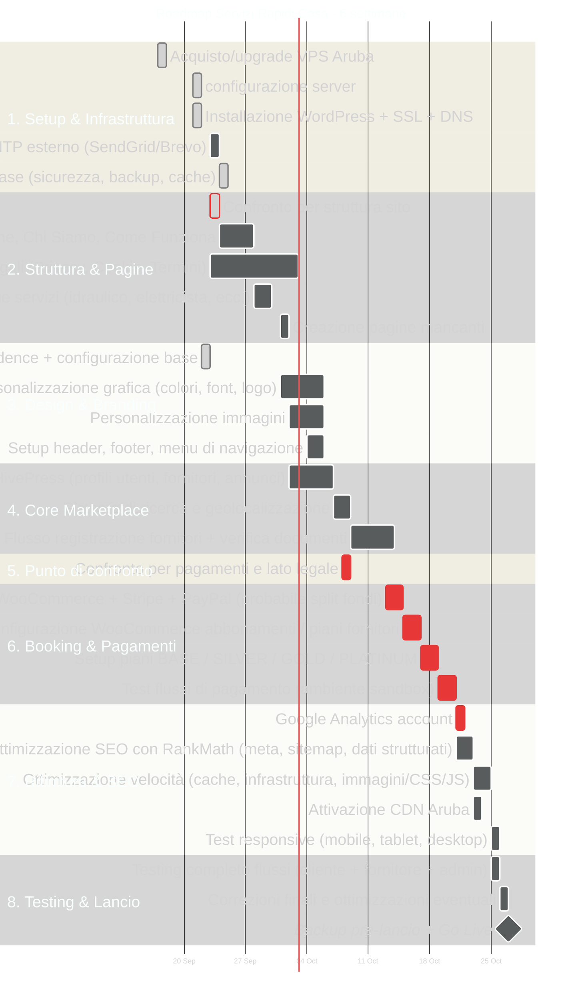

# Roadmap Sito Web — Servizi Rapidi Casa

## 📋 Prefazione

Questo documento è la **roadmap ufficiale di progetto** per la realizzazione del sito web *Servizi Rapidi Casa*. Serve a:

1. **Condividere chiaramente** le fasi di lavoro, le tempistiche e le responsabilità.
2. **Evitare malintesi** su "quando sarà pronto" e "cosa serve da voi".
3. **Tracciare lo stato di avanzamento** in modo trasparente, senza bisogno di continue chiamate o messaggi.

>  **Come leggere questo documento:** ogni sezione ha una data di inizio e fine. Se i materiali (testi, logo, foto) arrivano in ritardo, le date successive slittano di conseguenza. La timeline è valida **solo se entrambe le parti rispettano le scadenze concordate**.

---

## 🗓️ Timeline di Progetto

